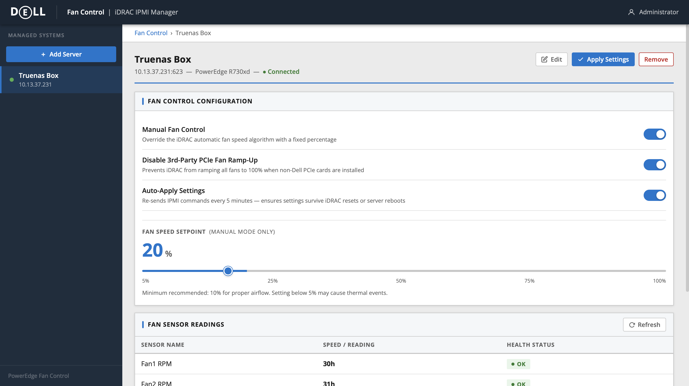
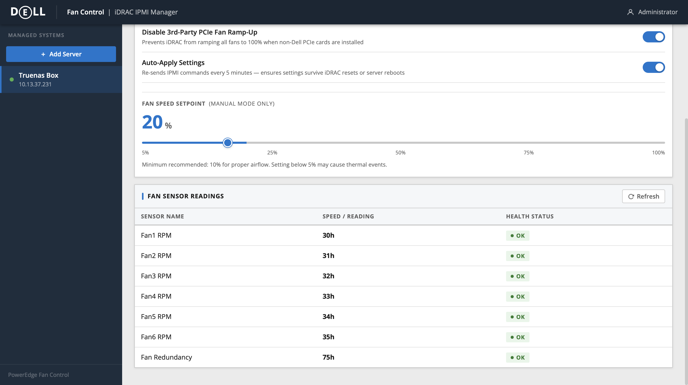
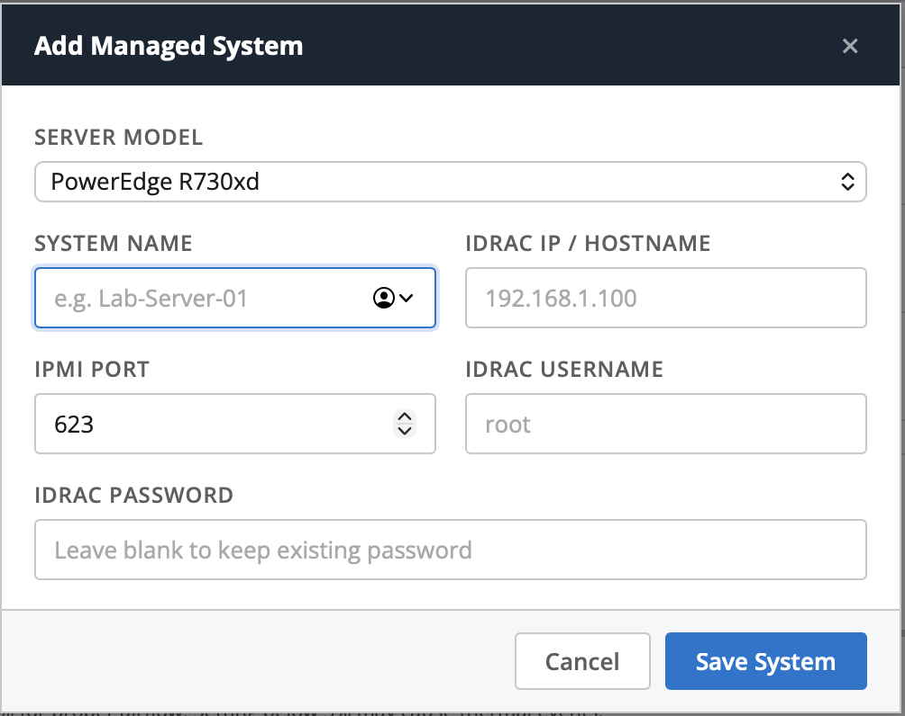
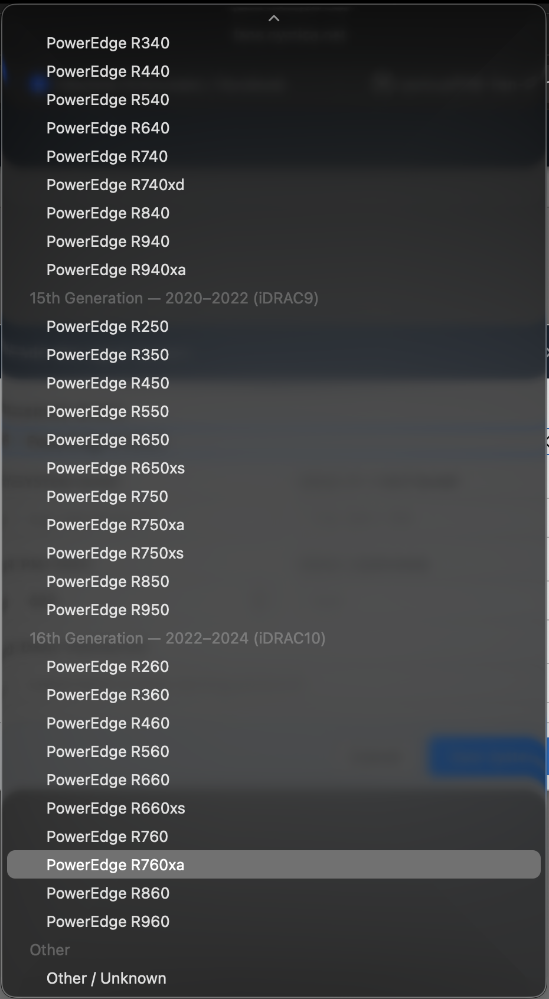

# PowerEdge Fan Control

A self-hosted web UI for managing Dell PowerEdge server fan speeds over IPMI. Set a fixed fan speed, suppress the 3rd-party PCIe card ramp-up, and let the app continuously re-apply your settings so they survive iDRAC resets and reboots.

[](https://hub.docker.com/r/nymica/ipmi-fan-controller)
[](LICENSE)

---

## Screenshots


*Fan Control Configuration — manual speed control, PCIe ramp-up suppression, and auto-apply toggles*


*Live fan sensor readings polled directly from iDRAC*


*Add a new managed server — select model, enter iDRAC credentials*


*Grouped server model selector — 12th through 16th generation PowerEdge servers*

---

## Features

- **Manual fan speed control** — override the iDRAC algorithm with a fixed percentage (5–100%)
- **3rd-party PCIe fan suppression** — prevent iDRAC from ramping fans to 100% when non-Dell PCIe cards are installed
- **Auto-apply** — re-sends IPMI commands every 5 minutes, so settings survive iDRAC resets and reboots
- **Multi-server management** — manage any number of servers from a single interface
- **Live fan sensor readings** — poll iDRAC for real-time fan RPM data
- **Per-model IPMI compatibility** — automatically applies only the commands supported by your server's generation

---

## Supported Servers

Fan speed control (`raw 0x30 0x30`) works across all supported generations. The 3rd-party PCIe fan suppression command (`raw 0x30 0xce`) is supported on 13th generation and later; it is skipped automatically for 12th-generation servers.

| Generation | Models | iDRAC | Fan Control | 3rd-Party PCIe Fix |
|---|---|---|---|---|
| **12th Gen** (2012–2014) | R320, R420, R520, R620, R720, R720xd, R820, R920 | iDRAC7 | ✅ | ❌ |
| **13th Gen** (2014–2016) | R230, R330, R430, R530, R630, R730, R730xd, R830, R930 | iDRAC8 | ✅ | ✅ |
| **14th Gen** (2017–2019) | R240, R340, R440, R540, R640, R740, R740xd, R840, R940, R940xa | iDRAC9 | ✅ | ✅ |
| **15th Gen** (2020–2022) | R250, R350, R450, R550, R650, R650xs, R750, R750xa, R750xs, R850, R950 | iDRAC9 | ✅ | ✅ |
| **16th Gen** (2022–2024) | R260, R360, R460, R560, R660, R660xs, R760, R760xa, R860, R960 | iDRAC10 | ✅ | ✅ |

> **Note:** The 3rd-party PCIe suppression command has been verified on 13th–15th generation servers. Behavior on 16th generation (iDRAC10) may vary by firmware version.

---

## Requirements

- Docker and Docker Compose
- Network access from the host to your iDRAC management interface (UDP port 623 by default)
- iDRAC credentials with Administrator privileges

---

## Quick Start

### Option A — Docker Hub (recommended)

```bash
docker pull nymica/ipmi-fan-controller
```

Create a `docker-compose.yml`:

```yaml
services:
  ipmi-fan-controller:
    image: nymica/ipmi-fan-controller:latest
    container_name: ipmi-fan-controller
    restart: unless-stopped
    ports:
      - "8765:5000"
    volumes:
      - fan_data:/data
    environment:
      - TZ=America/Chicago

volumes:
  fan_data:
```

Then start it:

```bash
docker compose up -d
```

### Option B — Build from source

```bash
git clone https://github.com/nymica/IPMI-Fan-Controller.git
cd IPMI-Fan-Controller
docker compose up -d --build
```

### Open the web UI

```
http://<your-docker-host>:8765
```

---

## Adding a Server

1. Click **+ Add Server** in the left sidebar.
2. Select your **Server Model** from the dropdown — this determines which IPMI commands are applied.
3. Fill in the **System Name**, **iDRAC IP / Hostname**, **IPMI Port** (default 623), **Username**, and **Password**.
4. Click **Save System**.
5. Select the server in the sidebar, configure your fan speed and options, then click **Apply Settings**.

---

## Configuration Options

Each managed server has three independent settings:

| Setting | Description |
|---|---|
| **Manual Fan Control** | Overrides the iDRAC automatic algorithm with a fixed fan speed percentage. When disabled, iDRAC resumes automatic control. |
| **Disable 3rd-Party PCIe Fan Ramp-Up** | Sends an OEM IPMI command that prevents iDRAC from spinning all fans to 100% when it detects a non-Dell PCIe card. Not available on 12th-gen servers. |
| **Auto-Apply Settings** | Re-sends all IPMI commands every 5 minutes. Useful if your iDRAC occasionally resets fan settings after firmware updates or power cycles. |

### Fan Speed Setpoint

The slider sets the fan speed percentage when **Manual Fan Control** is enabled. Range is 5–100%.

> **Minimum recommended:** 10% for adequate airflow. Setting fans too low on heavily loaded servers can cause thermal events.

---

## IPMI Commands Used

The following raw IPMI OEM commands are sent to iDRAC:

```
# Enable manual fan control
ipmitool raw 0x30 0x30 0x01 0x00

# Set fan speed to N% (e.g. 20% = 0x14)
ipmitool raw 0x30 0x30 0x02 0xff 0x14

# Disable automatic fan control (hand back to iDRAC)
ipmitool raw 0x30 0x30 0x01 0x01

# Suppress 3rd-party PCIe fan ramp-up (13th gen+)
ipmitool raw 0x30 0xce 0x01 0x16 0x05 0x00 0x00 0x00 \
         0x00 0x00 0x00 0x00 0x00 0x00 0x00 0x00 0x00 \
         0x00 0x00 0x00 0x00 0x00 0x00 0x00 0x00
```

---

## Data Persistence

Server credentials and settings are stored in a SQLite database inside a named Docker volume (`fan_data`), mounted at `/data/servers.db` inside the container. The database persists across container restarts and image rebuilds.

To back up your configuration:

```bash
docker cp ipmi-fan-controller:/data/servers.db ./servers.db.bak
```

---

## Updating

```bash
# Docker Hub
docker compose pull
docker compose up -d

# Built from source
docker compose up -d --build
```

Your database volume is preserved automatically.

---

## Troubleshooting

**Connection fails / "Unreachable"**
- Verify iDRAC network access: `ping <idrac-ip>` and `ipmitool -I lanplus -H <idrac-ip> -U root -P <pass> chassis status`
- Check that UDP port 623 is not blocked by a firewall between your Docker host and the iDRAC interface
- Confirm the credentials have Administrator-level iDRAC privileges

**Fan control command errors**
- Some iDRAC firmware versions require manual control to be enabled before the speed command is accepted — the app always does this in the correct order
- If you see `raw 0x30 0xce` errors on a 13th+ gen server, try upgrading iDRAC firmware

**Settings revert after a few minutes**
- Enable **Auto-Apply Settings** for that server — iDRAC may be resetting fan control after its own health checks

---

## Security Notes

- iDRAC credentials are stored in plaintext in the SQLite database. Keep the Docker volume and network access restricted to trusted hosts.
- The web UI has no authentication layer — it is intended for use on a private management network, not exposed to the internet.
- Run the container on an isolated management VLAN alongside your iDRAC interfaces.

---

## License

Copyright 2026 Chris Wiedmaier. Licensed under the [Apache License, Version 2.0](LICENSE).
